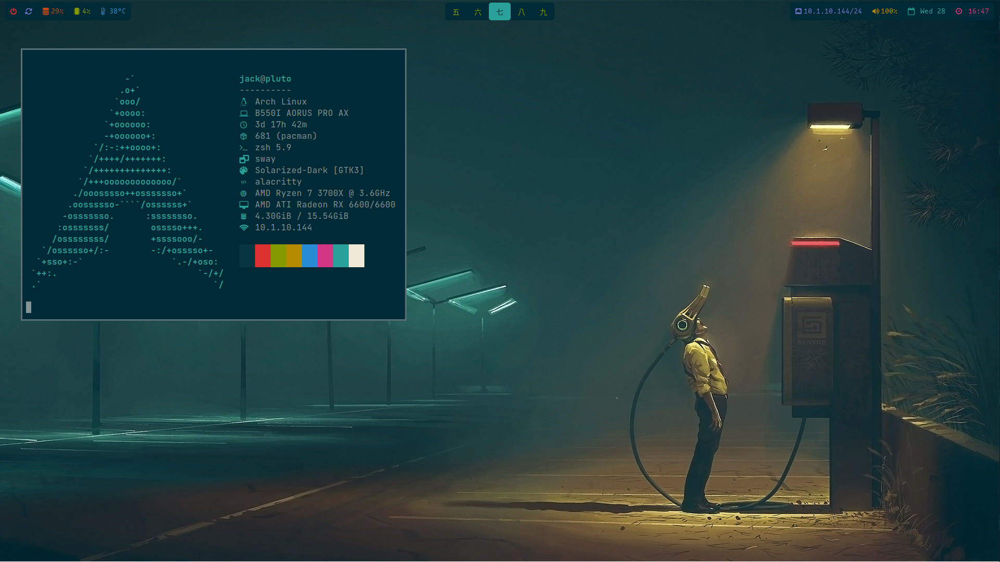
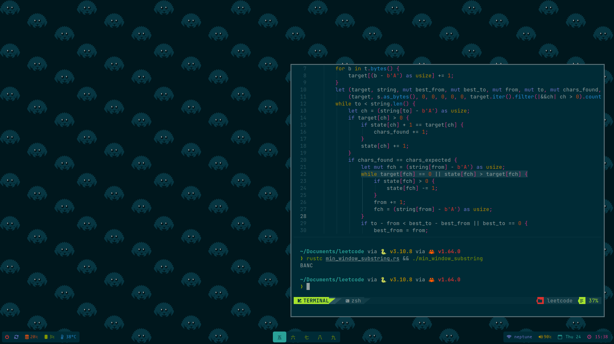
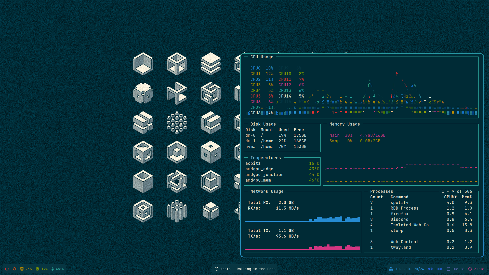
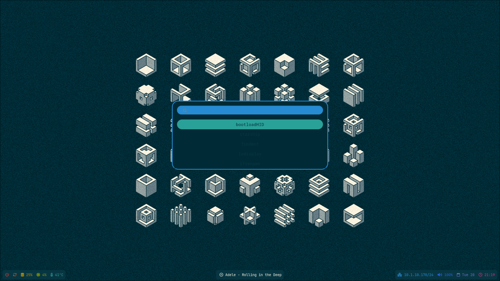
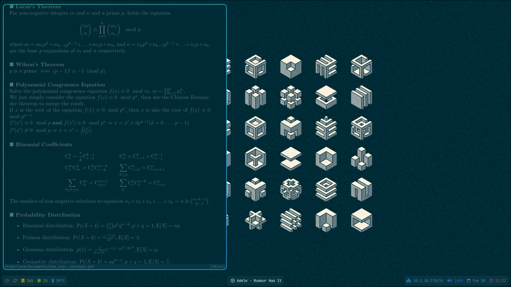
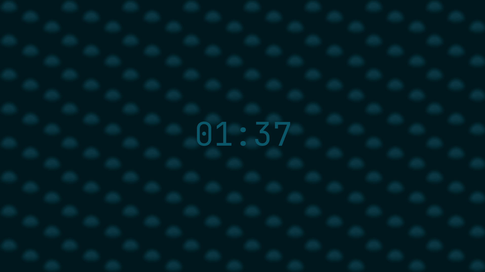

### nord dotfiles

#### nvim

#### gotop

#### wofi

#### zathura

#### gtklock

#### programs/tools:
- window manager: [sway](https://swaywm.org)
- bar: [waybar](https://github.com/Alexays/Waybar)
- app launcher: [wofi](https://hg.sr.ht/~scoopta/wofi)
- notifications: [mako](https://github.com/emersion/mako)
- lock screen: [gtklock](https://github.com/jovanlanik/gtklock)
- keyboard manager: [keyd](https://github.com/rvaiya/keyd)
- terminal: [st](https://st.suckless.org)
- shell: [zsh](https://github.com/zsh-users/zsh.git)
- editor: [neovim](https://neovim.io) using [nvchad](https://nvchad.github.io)
- document viewer: [zathura](https://pwmt.org/projects/zathura/)
- system monitor: [gotop](https://github.com/xxxserxxx/gotop.git)
- gtk theme: [nordic](https://github.com/EliverLara/Nordic)

#### `wpa_cli` notes
```shell
> scan
...
<3>CTRL-EVENT-SCAN-RESULTS
> scan_results # run once above event appears
bssid / freq / sig lvl / flags / ssid
...
> add_network
#
> set_network # ssid "my network"
> set_network # psk "my psswd"
# or if no password:
> set_network # key_mgmt NONE
> enable_network #
> save_config
```
